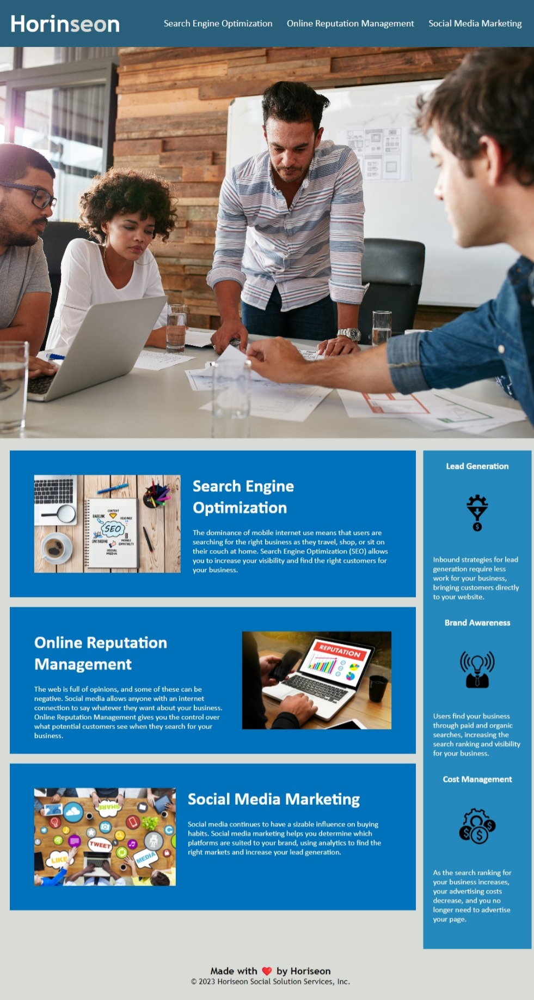

# Horiseon Marketing Agency 🚀

## Description
This repository contains the source code for the Horiseon Marketing Agency website, which was supplied to us. Our mission was to enhance the webpage's user-friendliness, especially for users that require extra accessability options such as a screen reader or other computer aids.

It's crucial to ensure that everyone, regardless of disability, can easily access and enjoy the internet, we want the internet to be a place where we can all enjoy! Not only that but having all the proper accessability options in place allows us to rank higher on the search engines results pages, that seems pretty important for a company that specialises in search engine optimisation 

 HTML and CSS are the backbone of every webpage, While HTML offers many features, this webpage initially lacked a focus on accessibility. To address this, we've utilized new semantic HTML5 elements and other techniques. Learn more in the [Features](#Features) section.

## Table of Contents

- [Dev Requirements](#Dev-Requirements)
- [Dev Environment Setup](#Dev-Environment-Setup)
- [End user usage instructions](#End-user-usage-instructions)
- [Features](#Features)
- [HowToContribute](#How-to-contribute)
- [technologies ](#technologies)
- [Screenshot](#Screenshot)
- [Credits](#credits)
- [License](#license)

## Dev Requirements
Git/GitBash, VS Code, and the source code, of course! 🛠️

## Dev Environment Setup
To get the development environment running:
1. Clone this repo
2. Open the repo folder in VS Code
3. Right-click on `index.html` and open it using the default browser..

- `index.html`: Contains all HTML code for the webpage
- `assets/styles.css`: Contains all CSS code for the webpage
- `assets/images/`: Contains all images used in the webpage

## Enduser usage instructions
There is no special requirements for end users. Simply visit [here](https://rossne99.github.io/Horiseon-Marketing-Agency/) to view the webpage. Enable your screen reader to explore accessability features.

## Features
- **Image Alt Text:** All images now have the alt attributes added to them, this will help with SEO and will be essential for users who require assistive technology.
- **Improved HTML Structure:** Substituted generic container elements and class names with relevant semantic elements and appropriate class names.
- **Page Headings:** All page titles and headings run in a logical, sequential order.
- **Fixed Navber:** The navbar is now fixed to the top of the page this is useful for accessibility additionally all the links in the nav bar now work.

## How to contribute
1. Fork this repository
2. Clone the repository
3. Create a branch for your bug fix or feature
4. Make necessary changes and commit those changes
5. Push changes to GitHub
6. Create a pull request to this repo to submit your changes for review

## Technologies
- **HTML**
- **CSS** 

## Screenshot
Visually looks the same as when I started however most of the changes I have made are under the hood.

The following image shows the web application's appearance and functionality:

> **Note**: This layout is designed for desktop viewing.

## Credits 
- **Horiseon** - Social Solution Services, Inc - Orignal Source Code
- **Ross** - Refactored Source Code

---

## Licence

MIT License

Copyright (c) 2023 RossNE99

Permission is hereby granted, free of charge, to any person obtaining a copy
of this software and associated documentation files (the "Software"), to deal
in the Software without restriction, including without limitation the rights
to use, copy, modify, merge, publish, distribute, sublicense, and/or sell
copies of the Software, and to permit persons to whom the Software is
furnished to do so, subject to the following conditions:

The above copyright notice and this permission notice shall be included in all
copies or substantial portions of the Software.

THE SOFTWARE IS PROVIDED "AS IS", WITHOUT WARRANTY OF ANY KIND, EXPRESS OR
IMPLIED, INCLUDING BUT NOT LIMITED TO THE WARRANTIES OF MERCHANTABILITY,
FITNESS FOR A PARTICULAR PURPOSE AND NONINFRINGEMENT. IN NO EVENT SHALL THE
AUTHORS OR COPYRIGHT HOLDERS BE LIABLE FOR ANY CLAIM, DAMAGES OR OTHER
LIABILITY, WHETHER IN AN ACTION OF CONTRACT, TORT OR OTHERWISE, ARISING FROM,
OUT OF OR IN CONNECTION WITH THE SOFTWARE OR THE USE OR OTHER DEALINGS IN THE
SOFTWARE.